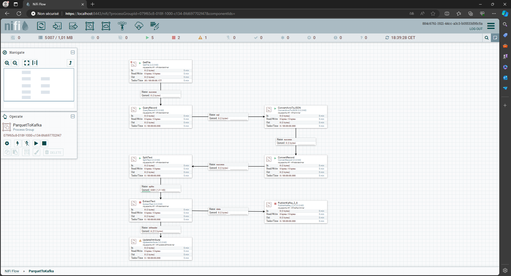
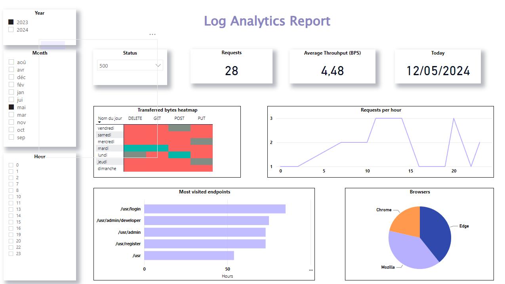

# Log Analytics
This project consists of creating an automatic process of analyising a website's logs through a realtime Power BI dashboard. Below is a walk-through of the process responsible of creating this analysis.

## Log generation
To imitate the behavior of producing regular logs, we have create a python program which generates a random parquet file containing log-like data. The python program is under "LOGGENERATOR" folder. Make sure to have a "logs" folder under "LOGANALYTICS" which will later contain the generated log data under parquet format.
In order to generate the file, execute the following commands from this folder:

    pip install LOGGENERATOR/requirements.txt
    py LOGGENERATOR/main.py

## Log detection and ingestion to Kafka
This generated file will be automatically detected and will be fed into a kafka topic "loganalytics". This process is done through the "NIFI" sub-project. Under that folder is a template for the architecture of processors responsible for this detection + ingestion logic. Below is a screenshot of this architecture.

This part assumes the user has the required installation in place of a Nifi and Kafka instance. Check The "NIFI" README for more details.

## Log transfer to MySql
Data saved in the Kafka instance will be consumed, preprocessed and later sent a MySql database. The sub-project "KAFKA" is responsible for this part of the work, so, take a loot at its README for more details.

## Log visualization
This part of the project is about linking the database to Power BI and creating your own dashboard. Below is a screenshot of my own attempt (saved under the "DASHBOARD" folder as a pbix file).

## Tech stack
- Apache Nifi
- Apache Kafka (with Zookeeeper)
- MySql
- Power BI
- Python + Java
- VS Code
